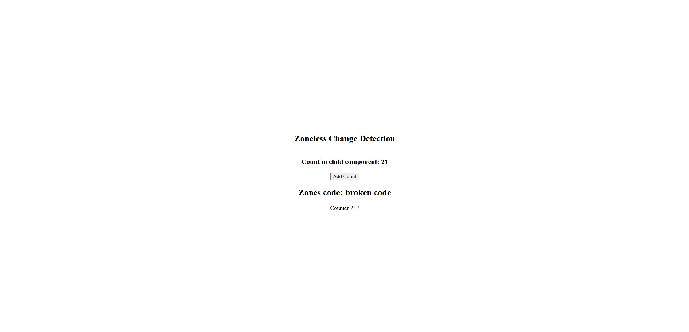

# Zoneless-VS-ZoneJS-demo

This project demonstrates the key differences between **traditional Zone.js-based change detection** and **zoneless change detection** in a fully zoneless Angular environment.

### What it shows

- Zone.js version: Automatic (magic) change detection on async operations (timers, promises, HTTP, events, etc.)
- Zoneless version: Explicit reactivity using **Signals** — no automatic patching, more control, better performance, no Zone.js overhead
- Vertical comparison of the same functionality (counter) in both styles

### Screenshot



_Image: Vertical view showing identical UI with different change detection approaches. Bottom: Zone.js (automatic updates), Top: Zoneless (signal-based updates)._

### How to run

```bash
npm run app-01
```
