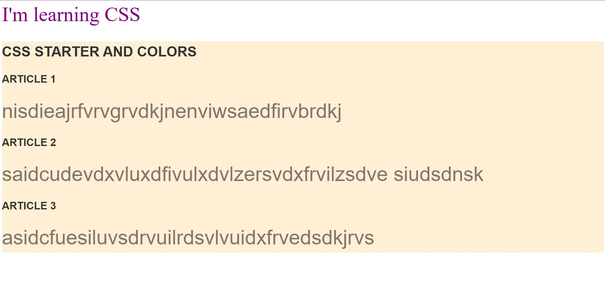

# CSS Starter

A minimal Angular starter project focused on **pure CSS basics** — perfect for experimenting with typography, colors, layout, and simple styling without frameworks.

### What it shows

- Clean, standalone Angular app structure
- Custom CSS for colorful text elements (headings, paragraphs, spans)
- Title + main content layout with vibrant color variations
- No external UI libraries — just vanilla CSS (SCSS supported)
- Good base to quickly prototype typography, color schemes, spacing, or responsive tweaks

### Screenshot



_Image: Simple page showing a bold colorful title and main content area with varied text colors for visual hierarchy and styling demo._

### How to run

```bash
npm run app-02
```
