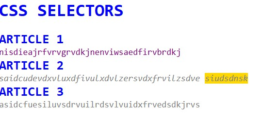

# CSS-Selectors-Specificity

A simple Angular demo that visually shows **CSS selector types** and **specificity rules** — helping understand which style wins when multiple rules apply to the same element.

### What it demonstrates

- **Element selectors** (`p`, `h1, h2`) → lowest specificity
- **Descendant combinator** (`p span`) → higher than simple element
- **Class selectors** (`.gray`) → beats element selectors
- **ID selectors** (`#second`) → highest specificity among these (beats class & element)
- **Cascade order** — how later rules can override earlier ones with equal or higher specificity
- Real-world priority: **ID > Class > Element** (ignoring inline styles & !important for this demo)

### Screenshot



_Image: Page showing multiple headings (blue), paragraphs (purple text), one with gray text + italic (via ID), another gray, and a gold-highlighted span inside a paragraph — clearly illustrating which selector "wins" for each part._

### How to run

```bash
npm run app-03
```
