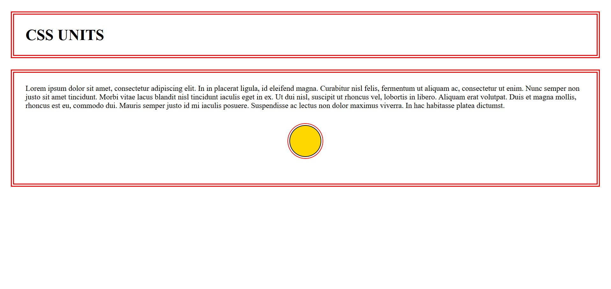

# CSS Units Demo

A clean Angular project that demonstrates the most commonly used **CSS units** and how they behave in practice — especially the difference between **absolute** and **relative** units.

### What it shows

- Relative units: `rem`, `em`
- Absolute units: `px`
- How `em` is relative to the **parent** element's font size
- How `rem` is relative to the **root** (`html`) font size
- Practical usage in `margin`, `padding`, `font-size`, `width`/`height`, `border`, `outline-offset`, etc.
- Visual comparison of spacing and sizing when units change

### Screenshot

_Image: A red double-bordered container with 1.5rem font size, 1.5em margin & padding, and a centered gold circle (100px fixed size) with rem-based margin and outline-offset — clearly showing relative vs absolute unit behavior._
