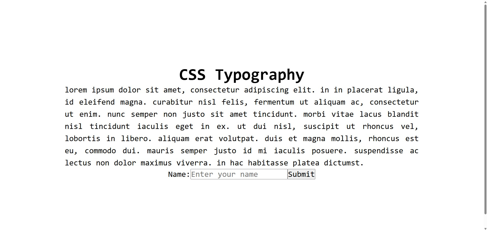

# CSS Typography Demo

A straightforward Angular project showcasing core **CSS typography properties** — ideal for understanding how fonts, text alignment, spacing, and inheritance work together to improve readability.

### What it demonstrates

- Font selection with fallback stack (`font-family: monospace;`)
- Global text styling: `text-align: center;` on body, `text-align: justify;` on paragraphs
- Text transformation (`text-transform: lowercase;`)
- Line height for better readability (`line-height: 1.5;`)
- Inheritance with `font: inherit;` on form elements (input & button match surrounding typography)
- Large base font size (`font-size: 2rem;`) + padding for spacious layout
- Commented-out examples (letter-spacing, word-spacing, font-style) for easy experimentation

### Screenshot

\*Image: Centered page layout with large "CSS Typography" heading, a justified lowercase lorem ipsum paragraph in monospace font, and a simple form (input + button) inheriting the typography styles — highlights spacing,
