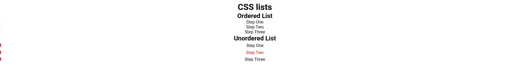

# CSS Lists

This project demonstrates how to style **ordered and unordered lists** using CSS. It shows how list markers, numbering, positions, and pseudo-elements can be customized to achieve different visual effects.

## Features

- Styling **ordered lists** using `list-style-type`
- Customizing **unordered list markers**
- Using the `::marker` pseudo-element to style list bullets
- Demonstrating `nth-child()` selector for targeted styling
- Modifying list numbering using HTML attributes like `start`, `reversed`, and `value`

## Purpose

This project helps understand how CSS can be used to fully control the appearance and behavior of HTML lists, making them more visually appealing and adaptable to different UI designs.
