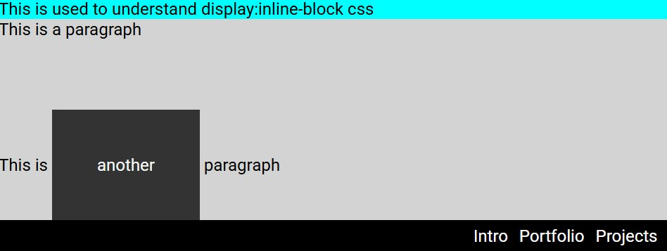

# CSS Display

This project demonstrates how the **CSS `display` property** affects the layout and behavior of HTML elements. It focuses primarily on understanding `inline-block` and how it differs from standard block and inline elements.

## Features

- Demonstrates how `display: inline-block` behaves
- Shows how block elements like `
` behave by default
- Creates a simple **navigation bar** using `inline-block`
- Demonstrates spacing and alignment with `margin`, `padding`, and `text-align`

## HTML Structure

The application contains two main sections:

### Display Demonstration

This section helps visualize how `inline-block` works within text content.

- A `` element is converted into an **inline-block**
- Padding and margin are applied to highlight layout differences
- Shows how inline elements can behave like blocks while still remaining inline

### Navigation Menu

A simple navigation bar built using:

- `<nav>`
- `<ul>`
- `<li>`
- `<a>`

List items are displayed horizontally using `display: inline-block`.

## CSS Concepts Demonstrated

### Display Property

The `display` property controls how elements are rendered in the document flow.

Examples include:

- `block`
- `inline`
- `inline-block`

### Inline Block Behavior

`inline-block` allows an element to:

- Sit inline with other elements
- Accept width, height, padding, and margins like a block element

This makes it useful for layouts such as **navigation menus** and **inline components**.

### Navigation Styling

The navigation bar demonstrates:

- Removing default list styles
- Displaying list items horizontally
- Styling links with hover and focus states

### Hover and Focus Effects

Interactive styling is applied using:

- `:hover`
- `:focus`

These improve usability and accessibility by providing visual feedback when links are interacted with.

## Purpose

This project helps illustrate the differences between **block**, **inline**, and **inline-block** elements while also demonstrating a practical use case—building a horizontal navigation menu using CSS.
