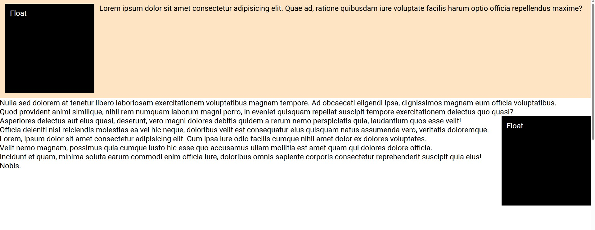

# CSS Float

This project demonstrates how the **CSS `float` property** affects the positioning of elements and how surrounding content flows around them. It illustrates the traditional layout technique used before modern layout systems like Flexbox and Grid became popular.

## Overview

The application shows how elements can be floated to the **left** or **right** side of a container while allowing text and other content to wrap around them. This behavior is commonly used in layouts such as images inside articles, magazine-style text wrapping, and simple page structures.

The project also highlights how floating elements interact with their parent containers and how layout issues caused by floats can be handled.

## Key Concepts Demonstrated

### Float Property

The `float` property moves an element to one side of its container while allowing surrounding content to flow around it.

Examples include:

- Floating elements to the **left**
- Floating elements to the **right**
- Text wrapping around floated elements

### Content Wrapping

When an element is floated, inline content such as text automatically flows around the floated element. This creates the classic **image-with-text-wrapping** effect often seen in articles and blogs.

### Spacing Around Floated Elements

Margins are applied to floated elements to create space between the floating element and the surrounding text, improving readability and layout clarity.

### Containing Floats with Flow Root

A common issue with floats is that parent containers may collapse because floated elements are removed from the normal document flow.

This project demonstrates the use of **`display: flow-root`** on a container to establish a new block formatting context. This ensures the container properly wraps around its floated children.

## Purpose

The purpose of this project is to help understand how the **float layout model works**, how content interacts with floated elements, and how to properly contain floats within their parent containers.

Although modern CSS layouts typically use **Flexbox or Grid**, understanding floats remains important for maintaining legacy code and for specific layout patterns where text wrapping is required.
