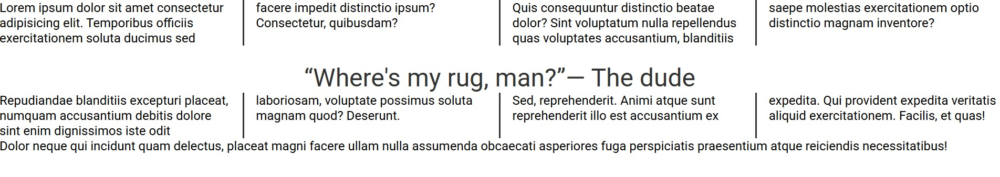

# CSS Columns

This project demonstrates how **CSS multi-column layout** can be used to divide content into multiple vertical columns, similar to the layout commonly seen in newspapers and magazines.

## Overview

The application shows how large blocks of text can automatically flow across several columns within a container. Instead of manually splitting content into different sections, CSS distributes the content across columns while maintaining readability and structure.

The project also demonstrates how certain elements can control column behavior, such as preventing breaks inside headings, spanning content across all columns, and controlling spacing between columns.

## Key Concepts Demonstrated

### Multi-Column Layout

CSS provides a **multi-column layout system** that allows content to be split into multiple vertical columns. The layout automatically balances text across the available columns.

The project uses the shorthand property that combines:

- Column count
- Column width

This allows the browser to determine the optimal number of columns based on the available space.

### Column Gap

Spacing between columns is controlled using the column gap property, which improves readability by preventing text from appearing too crowded.

### Column Rule

A vertical line between columns is created using a **column rule**, visually separating each column and making the layout resemble traditional print layouts.

### Preventing Content Breaks

Headings are styled so they **do not break across columns**. This ensures that titles remain visually connected with their associated content rather than being split between columns.

### Spanning Content Across Columns

The project demonstrates how specific content, such as quotes or special text blocks, can **span across all columns** instead of being restricted to just one column. This is useful for highlighting important information.

### Controlling Text Wrapping

A utility class is used to prevent certain text from wrapping onto multiple lines. This ensures that specific phrases remain visually intact.

## Purpose

The purpose of this project is to demonstrate how **CSS multi-column layouts** can be used to organize long-form text content in a clean and structured way. It helps illustrate techniques commonly used in editorial layouts, articles, and content-heavy webpages where readability and presentation are important.
