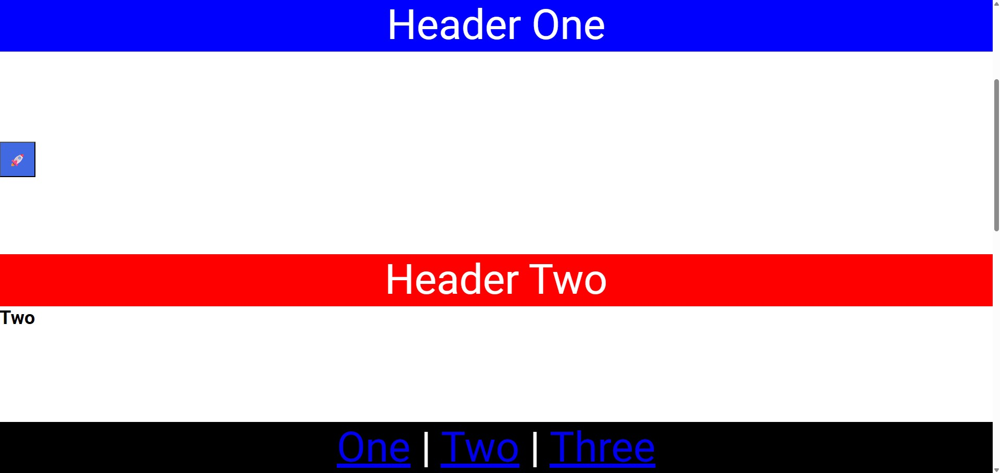

# CSS Position

This project demonstrates how the **CSS `position` property** controls the placement of elements within a webpage. It focuses on commonly used positioning techniques such as **fixed positioning**, **sticky positioning**, and layering elements using **z-index**.

## Overview

The application contains multiple sections that fill the viewport height, allowing users to scroll through the page while observing how positioned elements behave. Certain interface elements remain visible during scrolling, illustrating how positioning can be used to create persistent navigation and interactive UI components.

## Key Concepts Demonstrated

### Sticky Positioning

Section headers use **sticky positioning**, which allows them to behave like normal elements until they reach a specified scroll position. Once that point is reached, the header remains fixed at the top of the viewport while its section is visible. This technique is commonly used for **section headers and navigation bars**.

### Fixed Positioning

Some elements remain fixed relative to the viewport regardless of scrolling. These elements stay visible at all times and do not move with the document flow.

Examples demonstrated in the project include:

- A persistent **footer navigation bar** anchored to the bottom of the screen.
- A floating **social action button** placed along the side of the page.

### Layering with Z-Index

The floating button is layered above other content using **z-index**, ensuring it remains visible even when overlapping other elements on the page.

### Full Viewport Sections

Each section fills the height of the viewport, creating a clear scrolling experience that makes it easier to observe how sticky and fixed positioned elements behave during page navigation.

### In-Page Navigation

The footer includes links that navigate between sections using anchor links. This demonstrates how positioning can work together with internal navigation to create smooth user experiences.

## Purpose

The purpose of this project is to help understand how different **CSS positioning strategies** influence layout behavior. It highlights practical patterns used in modern web interfaces, such as sticky headers, floating action buttons, and fixed navigation bars.
