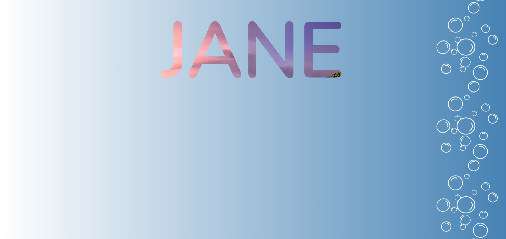

# CSS Images

This project demonstrates how **images can be used creatively in CSS** to enhance visual design. It focuses on using images as backgrounds, combining multiple backgrounds, and applying **text clipping techniques** to create visually striking typography.

## Overview

The application showcases how CSS allows images to be layered and manipulated directly through styling. Instead of inserting images only through HTML elements, CSS can apply images as backgrounds, combine them with gradients, and even use them to fill text.

One of the highlights of this project is the **image-filled text effect**, where an image becomes visible only inside the characters of a word.

## Key Concepts Demonstrated

### Multiple Backgrounds

CSS allows multiple backgrounds to be applied to a single element. In this project:

- A repeating image pattern is positioned along one side of the container.
- A gradient background is layered behind it.

This demonstrates how multiple background layers can create richer visual designs without additional HTML elements.

### Background Gradients

A gradient is combined with an image background to create a smooth color transition across the page. This technique is commonly used to add depth and visual interest to a layout.

### Background Positioning and Repetition

The background image pattern is positioned along a specific side of the container and repeats vertically. This demonstrates how CSS can control:

- Image placement
- Repetition direction
- Layer ordering

### Image Clipping for Text

The project demonstrates the **background clipping technique**, where an image is used as the fill for text. Instead of displaying the text in a solid color, the background image becomes visible only within the shape of the letters.

This effect is achieved using `background-clip: text` along with transparent text color.

### Large Typography Effects

The text is intentionally styled with a very large font size and strong weight to highlight the clipped image effect, creating a bold visual centerpiece for the page.

## Purpose

The purpose of this project is to demonstrate creative ways of working with **CSS images and backgrounds**. It shows how images can be layered, positioned, and clipped to produce modern visual effects without relying on complex graphics or additional HTML structure.
