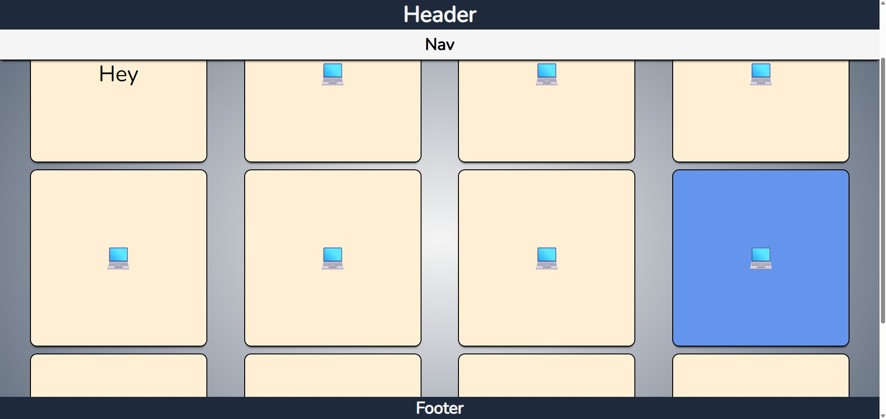

# CSS Variables

This project demonstrates how **CSS Custom Properties (commonly called CSS variables)** can be used to create flexible, reusable, and maintainable styling systems.

## Overview

The application uses CSS variables to control many visual aspects of the layout such as colors, fonts, spacing, borders, shadows, and component sizes. Instead of repeating values throughout the stylesheet, variables allow styles to be defined once and reused across multiple elements.

The layout contains a header, navigation bar, main content area, and footer. Inside the main section, multiple square components are displayed in a responsive layout to demonstrate how variables can control component styling consistently.

## Key Concepts Demonstrated

### CSS Custom Properties

CSS variables allow developers to store reusable values that can be referenced throughout the stylesheet. This helps maintain consistency and simplifies updates when design values change.

Examples of properties controlled by variables include:

- Font settings
- Background colors
- Component sizes
- Padding and spacing
- Borders and shadows

### Centralized Design System

By defining common values as variables, the project effectively creates a **small design system**. This makes it easier to maintain visual consistency across the entire interface.

If a design value needs to change, it can be updated in one place and applied everywhere it is used.

### Component-Level Variable Overrides

The project demonstrates how variables can be overridden for specific components. One of the square elements overrides the default background color variable to create a highlighted version of the component.

This shows how CSS variables support **scoped customization**, allowing individual components to behave differently without duplicating styles.

### Responsive Layout with Flexbox

The main content area uses a flexible layout that allows the square components to wrap across rows. Spacing between items is dynamically controlled, demonstrating how layout properties can work together with variables.

### Consistent Visual Styling

Multiple visual elements such as borders, shadows, and font sizes are driven by variables. This ensures the interface remains visually consistent while reducing code repetition.

## Purpose

The purpose of this project is to demonstrate how **CSS variables improve scalability and maintainability in modern stylesheets**. By centralizing styling values and allowing scoped overrides, developers can build cleaner and more adaptable UI systems.
